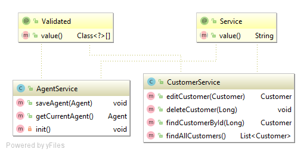
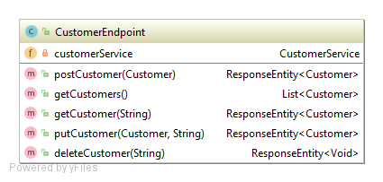

# Spring Boot API Example

This example illustrates how business logic and an API can be implemented with the help of Spring (Boot) MVC, and finally documented with Swagger/OpenAPI.

#### Contents:
- [Microservice Application](#microservice-application)
- [Business Layer](#business-layer)
- [Service Layer / API](#service-layer--api)
- [Swagger/OpenAPI Documentation](#swaggeropenapi-documentation)

## Microservice Application

You may change the `PORT` and other database specific properties of the microservice using the `src/main/java/resources/application.yml` (you may have to convert it).

```yml
server:
  port: 8080
```
## Business Layer

Create the `ch.fhnw.acrm.business.service` package and in this package the following business services:



Implement the `CustomerService` and the `AgentService` business logic.

> Please note, at this stage of the application, without user management / security enabled,  we may need some initial data:

```Java
@PostConstruct
private void init() throws Exception {
	Agent agent = new Agent();
	agent.setName("Demo");
	agent.setEmail("demo@demo.ch");
	agent.setPassword("password");
	this.saveAgent(agent);
}
```

## Service Layer / API

On the service layer, we are going to implement an API for customer management. This will be realised using the REST style as depicted in the following:


[Spring Web](https://docs.spring.io/spring/docs/current/spring-framework-reference/web.html) is providing the following annotations to implement REST services:

- `@RestController` annotation identifies a Spring Web REST component.
- `@RequestMapping` defines the basic `path` of a REST API.
- `@GetMapping`, `@PutMapping`, `@PostMapping` and `@DeleteMapping` can be used to define the basic CRUD-style REST verbs and HTTP methods in companion with the corresponding `path` and its resource representation format specified by `consumes` and `produces`.
- `@RequestBody` declares an method parameter to be the body of a request. 
- `@RequestParam` stands for a query parameter that can be added to a requesting path.
- `@PathVariable` declares an method parameter to be the placeholder of a path such as `/api/xyz/{pathVariable}`

Besides the annotations, the following classes can be used for response, HTTP status and exceptions:
- The `ResponseEntity<T>` class can be used to give the response body / message (of a certain type `T`) a HTTP status along.
- The `ResponseStatusException` is used to send an Exception message along with a HTTP status code.
- The `ResponseEntity.accepted().build()` statement gives an empty response with a HTTP status code.
- The `ResponseEntity.created(location).body(orderMessage)` statement provides a response body along with an HTTP status code and a location HTTP header information.

Implement the following `CustomerEndpoint` in conjunction with the methods described above:



## Swagger/OpenAPI Documentation

Create the `ch.fhnw.acrm.config` package and implement the following `SwaggerConfig` class:

```Java
@Configuration
public class SwaggerConfig {
    @Bean
    public Docket api() {
        return new Docket(DocumentationType.SWAGGER_2)
                .select()
                .apis(RequestHandlerSelectors.any())
                .paths(PathSelectors.regex("(?!/error).+"))
                .build();
    }
}
```

Boot your container and access the Swagger UI using the following URL: [http://localhost:8080/swagger-ui/](http://localhost:8080/swagger-ui/).